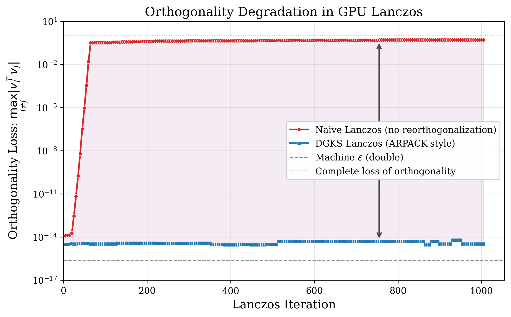
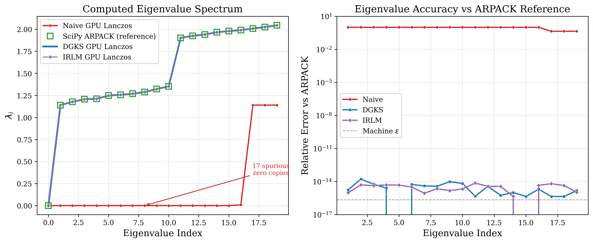

# gpu-lanczos: a Differentiable Spectral Toolkit on GPU

A numerically robust GPU implementation of the **Implicitly Restarted Lanczos Method (IRLM)** with ARPACK safeguards, plus a **differentiable spectral toolkit** built on top: matrix-function application via Lanczos quadrature with Krämer-style adjoint backward, stochastic Lanczos quadrature for log-determinants, and end-to-end differentiation through arbitrary parameterised operators.

The toolkit is designed to unblock graph-GP marginal-likelihood maximisation at scales where existing solutions either OOM (dense `torch.linalg.slogdet`) or misconverge (naive Lanczos quadrature, per the IMGP paper's Table-2 footnote). See [docs/PLAN.md](docs/PLAN.md) for the research narrative.

## What's in here

- **`gpu_eigsh.gpu_eigsh`** — drop-in replacement for `scipy.sparse.linalg.eigsh`, backed by a CUDA IRLM with DGKS reorthogonalisation, implicit restarts, mixed precision, and shift-invert. ARPACK-faithful at every scale, 53× faster at n = 10⁶.
- **`gpu_eigsh.funm_torch`** — Lanczos-based differentiable matrix-function primitives. `funm_apply_kraemer`, `funm_qform_op`, `slq_logdet` are `torch.autograd.Function`s with custom Krämer 2024 adjoint backward.
- **`gpu_eigsh.imgp`** — differentiable IMGP precision operator wrapper. Plug into your training loop in place of `precision_operator.inv_quad_logdet(logdet=True)[1]`.
- **`gpu_eigsh.imgp_train`** — three reference training loops with identical data/init/optimiser, differing only in the log-det method: `imgp_train_ours` (our SLQ), `imgp_train_dense` (SS-IMGP-full row of the IMGP paper), `imgp_train_naive_lanczos` (the row of the paper's Table-2 footnote).

## Differentiable spectral toolkit — what works today

| Layer | API | Status |
|---|---|---|
| 1. `f(A)·v` forward in CUDA for f ∈ {log, exp, sqrt, inv} | `funm_apply` | ✅ machine precision vs `torch.linalg.eigh` |
| 1b. Krämer-adjoint backward for differentiable f(A)·v | `funm_apply_kraemer` | ✅ machine-precision gradcheck (no-reortho path, m/n ≲ 0.25) |
| 2. Stochastic Lanczos quadrature for log det A | `slq_logdet` | ✅ batched over m_probes; ∼0.2% Hutchinson noise on forward, ∼2% on gradient |
| 3. Operator-callable autograd through matvec(x, *params) | `funm_qform_op` | ✅ machine-precision adjoint vs same-formulation autograd |
| IMGP integration: differentiable graph-Matérn precision operator | `make_imgp_precision_matvec` | ✅ matvec matches dense reference at 1e-16; SLQ ∂(log det P)/∂(κ, θ) at ∼3e-3 vs analytic |

See [docs/PLAN.md](docs/PLAN.md) and [figures/imgp_scaling.png](figures/imgp_scaling.png) for current empirical results.

## Quick start

Run the 60-second demo:

```bash
/usr/bin/python3 examples/quickstart_slq.py
```

This builds a parameterised sparse operator $A(\theta_1, \theta_2)$, estimates $\log\det A$ via SLQ, backpropagates, and verifies both gradients against the dense analytic ground truth (~0.3-0.6% Hutchinson noise). Then plug the same pattern into your own model:

```python
import torch
from gpu_eigsh.funm_torch import slq_logdet

# A user-defined parameterised matvec: A(θ)·x where θ are autograd-tracked tensors.
# The matvec must accept either a 1-D vector or a 2-D (n, B) right-hand side
# (the (n, B) form lets SLQ batch all Hutchinson probes in one matvec call).
def my_matvec(x, theta1, theta2):
    return theta1 * x + sparse_L @ (theta2 * x)   # any PyTorch ops

theta1 = torch.tensor(1.5, requires_grad=True, device="cuda")
theta2 = torch.tensor(0.7, requires_grad=True, device="cuda")

# log det A(θ) by stochastic Lanczos quadrature, differentiable end-to-end.
logdet = slq_logdet(
    my_matvec, n=1_000_000, params=(theta1, theta2),
    m_probes=20, lanczos_m=15, seed=0,
    dtype=torch.float32, device="cuda",
)
logdet.backward()
# theta1.grad, theta2.grad are now populated.
```

**Demonstrated scale: N = 10⁶ on a 16 GB GPU in ~90 seconds for a full training run.**

For IMGP-style graph-Matérn GPs see `gpu_eigsh.imgp.make_imgp_precision_matvec` and [benchmark/imgp_demo.py](benchmark/imgp_demo.py). The full scaling story (dense baseline OOMs past N = 2000; naive Lanczos diverges past N = 500 000; ours scales to N = 10⁶) is reproducible via:

```bash
/usr/bin/python3 benchmark/imgp_scaling_sweep.py \
        --ns 500 2000 5000 10000 50000 100000 500000 1000000 \
        --max-n-full 2000 --device cuda --dtype float32 \
        --synthetic-threshold 100000
/usr/bin/python3 benchmark/plot_imgp_scaling.py
# → figures/imgp_scaling.png
```

---

## Foundational layer: ARPACK-quality GPU IRLM

A numerically robust GPU implementation of the **Implicitly Restarted Lanczos Method (IRLM)**, faithfully porting the numerical safeguards from ARPACK to CUDA.

Existing GPU Lanczos implementations are "straightforward rewrites of the most basic algorithm from Wikipedia" — they lose orthogonality after ~50 iterations and produce spurious eigenvalues. This implementation ports the safeguards that make ARPACK reliable:

- **DGKS conditional reorthogonalization** (Daniel-Gragg-Kaufman-Stewart criterion from `dsaitr.f`)
- **Implicit QR restarts** via Givens bulge chase (`dsapps.f`)
- **Exact shift selection** with unwanted Ritz values (`dsgets.f`)
- **Dynamic NEV adjustment** for anti-stagnation (`dsaup2.f`)
- **Convergence checking** via Ritz estimates (`dsconv.f`)
- **Multi-step safe scaling** near underflow (LAPACK `dlascl`)

All heavy linear algebra runs on GPU (cuSPARSE, cuBLAS). Control flow stays on CPU. Zero GPU memory allocations inside any inner loop.

## Results

Verified against SciPy's `eigsh` (which calls ARPACK) on the **exact same matrix** at every scale:

| n | GPU IRLM | SciPy ARPACK | Speedup | Max Rel Error |
|---|---|---|---|---|
| 5,000 | 0.3s | 0.2s | 0.6x | 7.9×10⁻¹⁵ |
| 10,000 | 0.3s | 0.3s | 1.0x | 2.1×10⁻¹⁴ |
| 50,000 | 0.7s | 9.7s | **13x** | 2.8×10⁻¹⁴ |
| 100,000 | 1.2s | 20.9s | **18x** | 1.2×10⁻¹⁴ |
| 500,000 | 6.9s | 169.9s | **25x** | 9.1×10⁻¹⁴ |
| 1,000,000 | 18.7s | 987.6s | **53x** | 1.1×10⁻¹³ |
| 5,000,000 | 155s | — | est. 100x+ | — |

All 20 eigenvalues converge at every scale. Tested on NVIDIA RTX 3080 Ti Laptop GPU.

### Orthogonality

Without reorthogonalization, the Lanczos basis loses all orthogonality by iteration ~70, producing spurious "ghost" eigenvalues (Paige's theorem). With DGKS, orthogonality stays at machine epsilon (~10⁻¹⁵) throughout:



### Eigenvalue Accuracy

IRLM matches ARPACK to machine precision across all eigenvalues. Naive Lanczos produces completely wrong results:



## Architecture

```
src/
  lanczos_types.cuh      — Types, error macros, numerical constants
  lanczos_context.cuh     — GPU context: handles, streams, pinned memory, pre-allocated buffers
  lanczos_ops.cuh         — Numerical primitives: SpMV, CGS, DGKS reorth, safe scaling
  tridiag.cuh             — CPU tridiagonal: Givens rotations, QR bulge chase, dstev wrapper
  cast_kernels.cu         — FP64↔FP32 conversion kernels for mixed-precision SpMV
  naive_lanczos.cu        — Naive Lanczos (no reorthogonalization) — baseline
  dgks_lanczos.cu         — DGKS Lanczos (reorthogonalization, no restarts)
  irlm_lanczos.cu         — Full IRLM (implicit restarts + DGKS) — the main solver
  main.cu                 — Benchmark driver
python/
  gpu_eigsh/              — Python wrapper: drop-in replacement for scipy.sparse.linalg.eigsh
benchmark/
  scipy_reference.py      — SciPy ARPACK reference for accuracy comparison
  plot_results.py         — Publication-quality plotting
  generate_large_laplacian.py  — Fast KNN graph generation via KD-tree
  scaling_benchmark.py    — Full scaling benchmark (n=5K to 10M)
```

Key design decisions:
- **Shared `LanczosContext`**: GPU handles, streams, pinned memory, and work buffers created once and reused across all algorithms. No per-algorithm setup/teardown overhead.
- **Zero inner-loop allocations**: All GPU buffers (reorthogonalization coefficients, orthogonality measurement, restart workspace) are pre-allocated. cuSPARSE descriptors are reused via `cusparseDnVecSetValues`.
- **`cudaEvent` timing**: Accurate GPU-only measurement, not `std::chrono`.
- **Adaptive breakdown tolerance**: Scales with estimated `||T||`, not hardcoded.
- **Mixed-precision SpMV**: Optional FP32 matrix values with FP64 Krylov basis. DGKS corrects the FP32 noise.

## Build

Requirements: CUDA toolkit (≥11.0), cuSPARSE, cuBLAS, cuSOLVER, LAPACK, BLAS.

```bash
make              # build
make run          # benchmark at n=5000 (Naive vs DGKS vs IRLM)
make ref          # run SciPy ARPACK reference on the same matrix
make plot         # generate plots
```

For large-scale testing:
```bash
# Generate a large graph Laplacian
python3 benchmark/generate_large_laplacian.py --n 1000000 --outdir data

# Run GPU IRLM on it
./build/lanczos_bench --mtx data/laplacian.mtx --eigs 20 --iters 2000 --ncv 120 --irlm-only --outdir data

# Mixed precision (FP32 SpMV)
./build/lanczos_bench --mtx data/laplacian.mtx --eigs 20 --iters 2000 --ncv 120 --irlm-only --mixed --outdir data
```

## Python API

```python
from gpu_eigsh import gpu_eigsh

# Drop-in replacement for scipy.sparse.linalg.eigsh
eigenvalues, eigenvectors = gpu_eigsh(L, k=20)
```

Build the Python extension:
```bash
cd python && python3 setup.py build_ext --inplace
```

## CLI Options

```
--n <size>        Matrix dimension (default: 5000)
--eigs <k>        Number of eigenvalues (default: 20)
--iters <max>     Maximum Lanczos iterations (default: 1000)
--ncv <size>      Krylov subspace size (default: auto = 3*eigs)
--tol <eps>       Convergence tolerance (default: 1e-12)
--mtx <file>      Load sparse matrix from Matrix Market file
--irlm-only       Skip Naive/DGKS, run IRLM only (for large problems)
--mixed           Enable mixed-precision SpMV (FP32 values + FP64 basis)
--outdir <dir>    Output directory for CSV/plots
```

## Why This Matters

There is no production GPU eigensolver with ARPACK-level numerical safeguards:

| Tool | GPU Lanczos? | ARPACK safeguards? |
|---|---|---|
| cuSOLVER | No Lanczos | N/A |
| Torch-ARPACK | CPU only | Yes |
| HLanc (2015) | Hybrid | Partial |
| Cucheb (2024) | Filtered Lanczos | No DGKS/IRLM |
| **This work** | **Full GPU** | **DGKS + IRLM** |

## References

- Lehoucq, Sorensen, Yang: *ARPACK Users' Guide* (1998)
- Sorensen: *Implicit Application of Polynomial Filters in a k-Step Arnoldi Method* (1992)
- Daniel, Gragg, Kaufman, Stewart: *Reorthogonalization and Stable Algorithms for Updating the Gram-Schmidt QR Factorization* (1976)
- Paige: *The Computation of Eigenvalues and Eigenvectors of Very Large Sparse Matrices* (1971)

## License

MIT